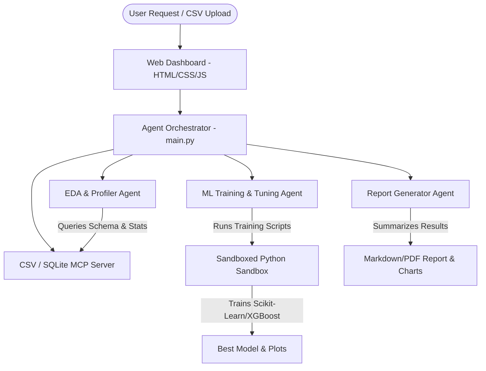

# VibeML: Autonomous AutoML Multi-Agent Assistant

VibeML is an autonomous, multi-agent AI assistant that automates the end-to-end Machine Learning (ML) and Exploratory Data Analysis (EDA) lifecycle. Built for the **Kaggle AI Agents Capstone Project (Agents for Business Track)**, it allows business analysts to upload raw CSV datasets, request predictive tasks in plain English, and watch a collaborative team of agents analyze data, train models, audit safety, and compile insights.

---

## 🚀 Problem Statement

Machine learning is a highly iterative process requiring specialized coding, feature engineering, and statistical knowledge. This leaves business leaders and analysts dependent on busy data science teams for basic predictions. 

**VibeML solves this** by providing a conversational interface where an autonomous multi-agent system acts as the data scientist. The agent handles the tedious work (data cleaning, scaling, tuning models, and producing plots) while keeping the environment secure and providing explainable, business-ready insights.

---

## 🛠️ Key Features

1. **Multi-Agent Orchestration**: Powered by the **Google Antigravity SDK**, coordinating three specialized agents:
   * **Data Profiler Agent**: Analyzes schemas, checks missing values, and designs model strategies.
   * **ML Engineer Agent**: Generates Python scripts to train candidate models (e.g. Scikit-Learn Random Forests, XGBoost).
   * **Reporter Agent**: Extracts metrics and plots to compile a business-ready markdown report.
2. **Model Context Protocol (MCP) Server**: A custom local data MCP server that bridges the Data Profiler to the CSV using SQL, minimizing token waste.
3. **AST-Based Security Sandbox**: Restricts the execution of LLM-generated code. Features a static syntax auditor that blocks dangerous calls (`eval`, `exec`, system shell) and unauthorized imports.
4. **Sleek Glassmorphic Dashboard**: A premium UI built with HTML, vanilla CSS (HSL design token palette, dark mode), and JavaScript featuring log polling and progress steps.

---

## 📐 Architecture Diagram



---

## 🎓 Course Concepts Applied

This project implements the following core concepts from the Kaggle AI Agents course:

| Concept | Implementation in VibeML | Location |
| :--- | :--- | :--- |
| **Agent / Multi-agent (ADK)** | Utilizes the `google-antigravity` SDK and `LocalAgentConfig` to coordinate cooperative agents. | `agents.py` |
| **MCP Server** | Implemented a custom `FastMCP` data querying server that runs local SQL queries on datasets. | `mcp_server.py` |
| **Security Features** | Statically audits generated code using Python's Abstract Syntax Tree (AST) before running it in a sandboxed process. | `security_policy.py` |
| **Deployability** | Provided a lightweight Docker container configurations and local execution scripts. | `Dockerfile`, `main.py` |

---

## ⚙️ Installation & Setup

### Local Setup

1. **Clone the Repository** (or navigate to your project directory):
   ```bash
   cd C:\Users\ronak\.gemini\antigravity\scratch\vibeml
   ```

2. **Set up Virtual Environment**:
   ```bash
   python -m venv venv
   # On Windows:
   .\venv\Scripts\activate
   # On macOS/Linux:
   source venv/bin/activate
   ```

3. **Install Dependencies**:
   ```bash
   pip install -r requirements.txt
   ```

4. **Configure Environment Variables**:
   Copy the example environment file:
   ```bash
   cp .env.example .env
   ```
   Open the `.env` file and add your Gemini API Key:
   ```env
   GEMINI_API_KEY=AIzaSy...
   ```

---

## 🏃 How to Run

1. **Launch the Dashboard**:
   Ensure your virtual environment is active and run:
   ```bash
   python main.py
   ```
   The dashboard will spin up a web server at [http://127.0.0.1:8000](http://127.0.0.1:8000).

2. **Using the Dashboard**:
   * Open the page in your browser.
   * Drag and drop the test dataset `uploads/churn_customer_data.csv` (or any custom CSV).
   * Specify the Target Column you want to predict (e.g. `churn` for the test dataset).
   * Click **Initiate AutoML Agent Loop**.
   * Watch the logs stream in as the agents collaborate.
   * Review the generated report, view evaluation plots, and download the trained model file (`best_model.joblib`).

### Run via Docker
To run in a containerized sandbox:
```bash
docker build -t vibeml-agent .
docker run -p 8000:8000 -e GEMINI_API_KEY="your_api_key" vibeml-agent
```
Access the dashboard at `http://localhost:8000`.

---

## 🛡️ Security & Sandboxing Details

VibeML implements a **Static Security Auditor** inside `security_policy.py`:
* **AST Parsing**: Converts generated Python code into an Abstract Syntax Tree (AST) using Python's standard `ast` library.
* **Module Allow-list**: Only allows imports from verified data science packages: `pandas`, `numpy`, `sklearn`, `xgboost`, `matplotlib`, `seaborn`, `joblib`, `json`, `math`, `collections`.
* **Dangerous Call Blocking**: Blocks execution if the code calls standard builtins like `eval()`, `exec()`, `__import__()`, `open()`, or attempts to access private properties (e.g. `__subclasses__`).
* **Isolated Subprocess**: Runs the verified script inside a separate subprocess with custom system environment overrides to limit OS filesystem access.
